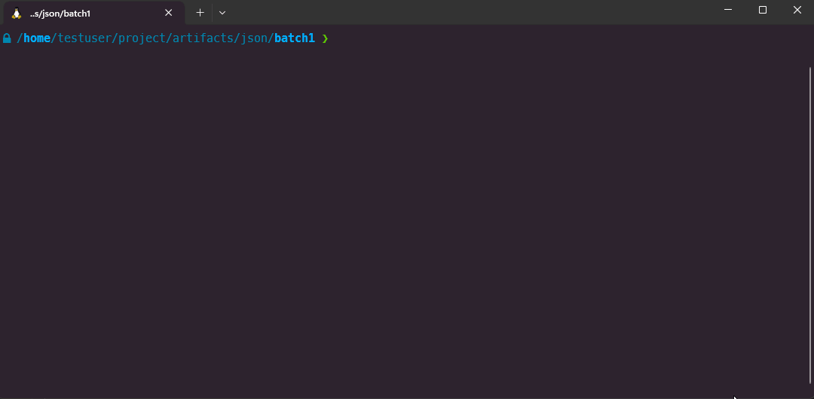

# useful_ubuntu_scripts
A collection of various scripts and hacks to help with day-to-day Ubuntu tasks.

## new_wsl_tab.sh

Opens a new Ubuntu WSL tab at the current location from the command line. Useful
when you wish to preserve a deep directory heirachy containing multiple levels of 
subdirectories when you open a new tab, without requiring the usual `pwd`, copy, 
click to open new tab, `cd` and paste.

This is an alternative to the official Microsoft guidance which can duplicate a tab
at current location using `ctrl+shift+d`:
https://learn.microsoft.com/en-us/windows/terminal/tutorials/new-tab-same-directory
